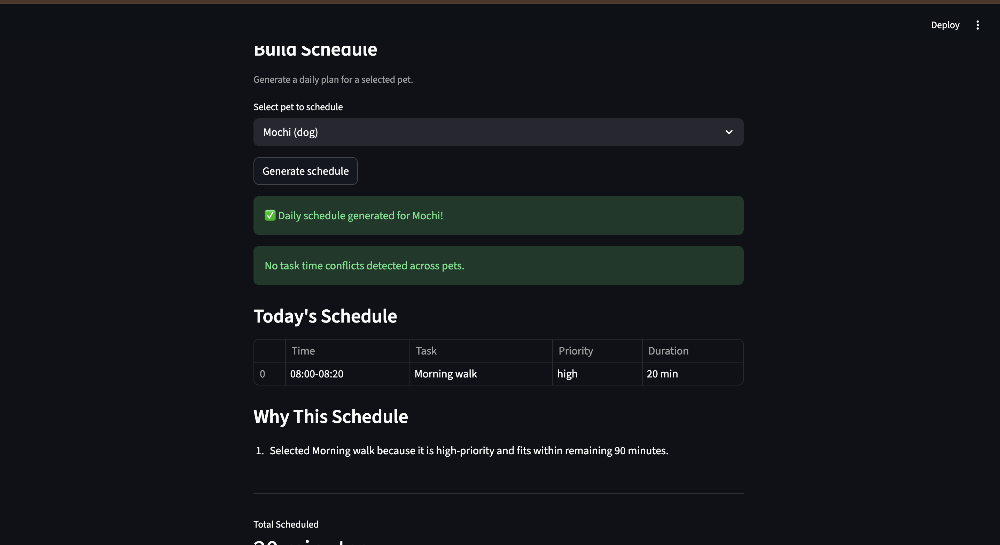

# PawPal+ (Module 2 Project)

You are building **PawPal+**, a Streamlit app that helps a pet owner plan care tasks for their pet.

## Scenario

A busy pet owner needs help staying consistent with pet care. They want an assistant that can:

- Track pet care tasks (walks, feeding, meds, enrichment, grooming, etc.)
- Consider constraints (time available, priority, owner preferences)
- Produce a daily plan and explain why it chose that plan

Your job is to design the system first (UML), then implement the logic in Python, then connect it to the Streamlit UI.

## Features

- **Owner + Multi-Pet Management**
	- Create an owner profile with time budget and preferred planning window.
	- Add and manage multiple pets, each with its own task list.

- **Task Modeling + Validation**
	- Task fields include priority, duration, optional due time/date, and recurrence frequency.
	- Validation guards for invalid durations, priorities, and date/time formats.

- **Priority-Aware Scheduling Algorithm**
	- Builds daily plans using deterministic ranking:
		1. required tasks first,
		2. higher priority first,
		3. earlier due time first,
		4. shorter duration first,
		5. alphabetical tie-breaker.

- **Sorting by Time**
	- Uses HH:MM sorting to present tasks in natural chronological order.

- **Filtering Engine**
	- Filter tasks by completion status and/or pet name for focused task views.

- **Recurring Task Rollover**
	- Completing a `daily` task auto-creates the next instance at +1 day.
	- Completing a `weekly` task auto-creates the next instance at +7 days.

- **Lightweight Conflict Warnings**
	- Detects overlapping scheduled intervals across same or different pets.
	- Returns non-fatal warnings so users can adjust tasks without app crashes.

- **Explainable Plans**
	- Every scheduled item includes a human-readable reason for selection.

- **Tested Reliability**
	- End-to-end pytest coverage for happy paths and edge cases.

## 📸 Demo

Save a screenshot of your Streamlit app as `pawpal_demo.png` in this project folder, then README will render it below:



If the image does not appear, confirm the file exists at the project root with that exact name.

## What you will build

Your final app should:

- Let a user enter basic owner + pet info
- Let a user add/edit tasks (duration + priority at minimum)
- Generate a daily schedule/plan based on constraints and priorities
- Display the plan clearly (and ideally explain the reasoning)
- Include tests for the most important scheduling behaviors

## Getting started

### Setup

```bash
python -m venv .venv
source .venv/bin/activate  # Windows: .venv\Scripts\activate
pip install -r requirements.txt
```

### Suggested workflow

1. Read the scenario carefully and identify requirements and edge cases.
2. Draft a UML diagram (classes, attributes, methods, relationships).
3. Convert UML into Python class stubs (no logic yet).
4. Implement scheduling logic in small increments.
5. Add tests to verify key behaviors.
6. Connect your logic to the Streamlit UI in `app.py`.
7. Refine UML so it matches what you actually built.

## Smarter Scheduling

The current scheduler includes several advanced behaviors beyond basic task ordering:

- **Time-based sorting** using HH:MM values so tasks can be ordered by planned time.
- **Task filtering** by completion status and pet name to support focused views.
- **Recurring task rollover** for `daily` and `weekly` tasks, automatically creating the next occurrence when completed.
- **Conflict detection warnings** that identify overlapping scheduled tasks across one or more pets without crashing the app.

## Testing PawPal+

Run the full test suite with:

```bash
python -m pytest
```

The tests cover core scheduling reliability, including:

- Task validation, completion status updates, and recurrence behavior (`once`/`daily`/`weekly`)
- Pet task management (add/remove/list active tasks)
- Owner constraints (time budget and preferred time windows)
- Scheduler ranking, time sorting, filtering, and daily plan generation
- Conflict detection for overlapping tasks and no-conflict boundary cases

**Confidence Level:** ★★★★★ (5/5)

Based on current results (all tests passing), the system is highly reliable for the implemented scope.
